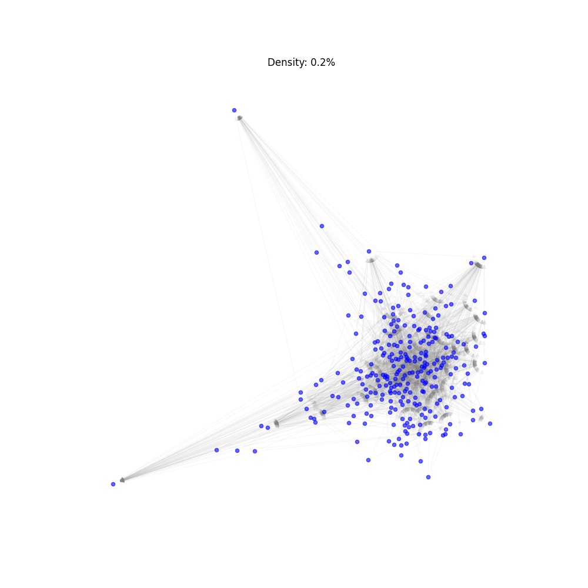
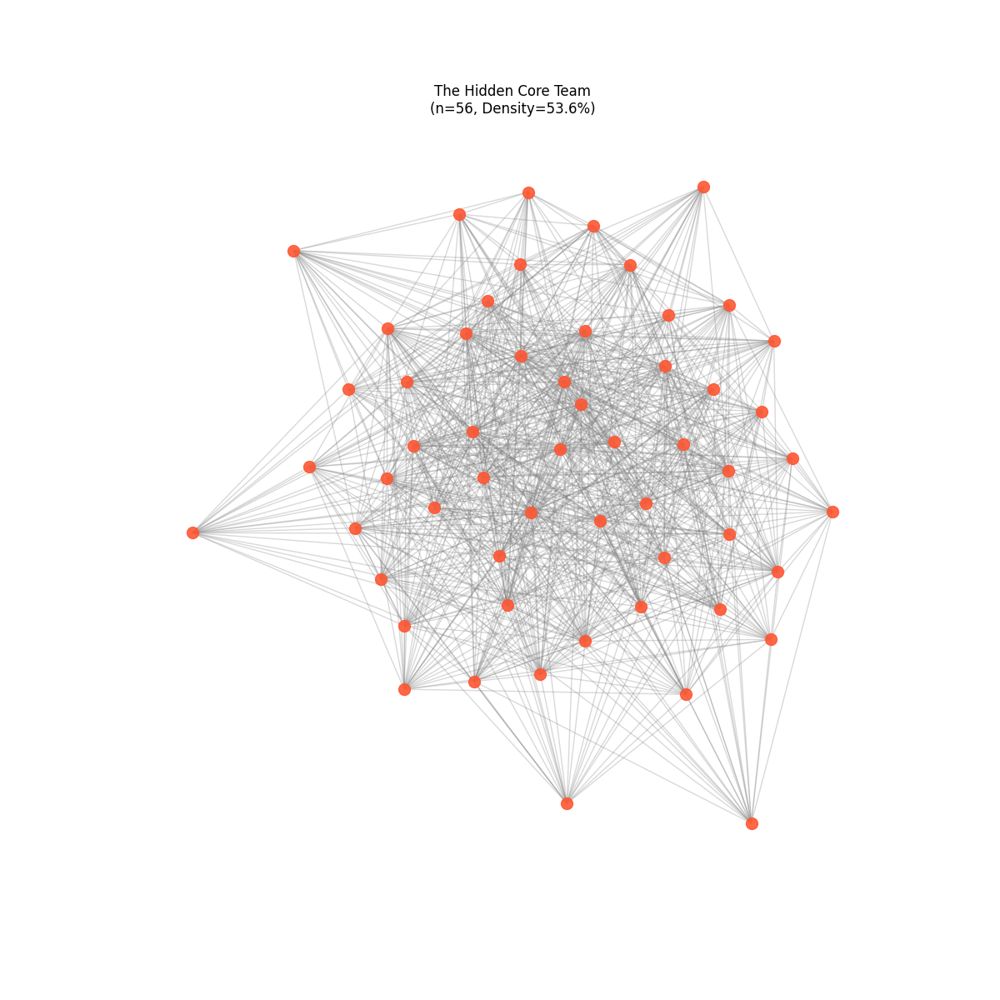

# New Kubernetes Dataset, and Overview of Artificial Density & Token Limits

**Date:** 2026-02-08
**Dataset:** Kubernetes (K-Core Filtered)
**Focus:** Interaction Density, Token Saturation, and Model Limits

## 1. Summary

This report covers the progression of our experiments to adapt the ClarityLoop engine—originally designed for dense Enterprise teams—to work with Open Source data.

Our starting point was the Pandas repository, where we found that the collaboration graph was too sparse (1.1% density) to trigger the engine's "Pattern Recognition" logic. To fix this, I moved to the Kubernetes repository, which is significantly larger and has a more active comment culture, to attempt an "Artificial Density" strategy.

The experiments ran in three phases:
1.  **Initial K-Core Run:** We identified a core group of maintainers but accidentally included their public interactions, resulting in a noisy dataset (0.2% density).
2.  **Strict Filter Run:** I implemented a strict "peer-to-peer" filter. This successfully created a dataset with **75% density**, but the volume of text per user was so high that it immediately crashed the LLM's 128k token limit.
3.  **Mini-Strict Run:** To get around the token crashes, I limited the scope to 12 months. This yielded a **35% density** dataset and successfully generated 1 Growth Opportunity.

**The Main Takeaway:**
We have effectively solved the "Data Sparsity" problem. By strictly filtering for core maintainers, we can generate Enterprise-grade interaction density from public data. However, this revealed a new bottleneck: **Context Window Saturation**. The sheer volume of high-density history per user often exceeds what the current model can process at one time, requiring aggressive truncation logic to function.

---

## 2. Phase 1: The Noise Problem (Initial Kubernetes Test)

The goal of this first phase was to use **K-Core Decomposition** to mathematically identify the "Core Team" of the Kubernetes repo—roughly 55 users who interact frequently.

The algorithm worked: it successfully found a cluster of 56 maintainers who had an internal interaction density of **53.6%**. In a vacuum, this looks like a tight-knit engineering squad.

### The Ingestion Error
The issue arose during the data ingestion step. My pipeline logic was set to "Find the Core Team, then download all conversations they participated in." Because these maintainers act as public gatekeepers, this pulled in interactions with over 1,100 random contributors.

This diluted the dataset significantly. Instead of a team of 55, the AI was presented with a graph of 1,184 users.
*   **Target Density:** >30%
*   **Actual Density:** 0.2% (Lower than the original Pandas run)

### Visualizing the Noise
The resulting network structure looked like a "Galaxy"—a dense core obscured by a massive cloud of outer nodes.

The graph above represents the data as the AI saw it. Top users like `lavalamp` or `0xmichalis` were connected to 100-150 unique people. In a real team, nobody talks to 150 unique colleagues directly. The AI interpreted this pattern not as "Leadership," but as "Transactional Support" (answering one-off tickets), which explains why it generated **0 Growth Opportunities** on the baseline prompt.

### Validating the Core
To confirm that the density was actually there, I ran a post-hoc analysis on the dataset to strip away the external users.

This graph (the "Hidden Core") proves that the signal exists. If we strip away the noise, we are left with a highly interconnected group. This confirmed that the failure wasn't due to the *nature* of the data, but rather the *selection* of the data.

## 3. Phase 2: High-Density Filtering

To fix the noise issue from Phase 1, I implemented a "Strict Allow-list" (or "Velvet Rope") strategy for the ingestion pipeline.

The logic was simple: instead of just grabbing all comments by the Core Team, I filtered the dataset to only include interactions where **both** the Sender and the Recipient were on the Core Team list. If a maintainer replied to a stranger, that comment was deleted.

**The Results:**
This approach worked as intended, but still faced some issues in practise. It produced a dataset with a smaller amount of **22 users**, but had an extremely high with an interaction density of **75.76%**.
*   **Purity:** 100% of the comments were peer-to-peer.
*   **Volume:** These 22 users generated over 10,000 comments among themselves.

However, this success created an immediate technical blocker. Because the dataset was so dense, the volume of text per user was massive. When I tried to run this through the engine, it immediately crashed with Token Limit errors. The history for a single user often exceeded 200,000 tokens, well past the model's 128k limit.

## 4. Phase 3: Token Limits & Context Saturation

For me this highlighted two possible issues, one being the tangable issue of token limit errors, and the other being a theoritical issue regarding context saturation.

### The Theory: Context Saturation
While the **Token Limit** errors were a tangible, hard blocker (the API simply rejected the requests), I suspect a deeper issue that could come into play (which is hard to measure due to the nature of LLMs), "Context Saturation." Even if we could fit 200k tokens into the model, feeding an LLM that much raw text in a single prompt often leads to the "Lost in the Middle" phenomenon, where the model struggles to retain specific details from the middle of the context window.

So, while the immediate problem was that the requests were physically too large, the underlying concern is that we might be flooding the model with too much information to effectively analyze anyway. In practise I dont think this should be an issue, as daily context is a lot lower, but in this case of uploading the entire context history at once, the issue is much more pronounced.

### The Fix: Iterative Truncation
To get the system running, I had to modify the backend logic (**Locally** adding a new method call in `FeedbackController.java`) to handle these massive payloads. I added the new string truncation method in a new class, `TokenLimitedJsonBuilder`.

This logic targets a safe limit of **110k tokens** (leaving room for the system prompt and response). It uses an iterative loop that tries to fit the JSON into the 128k limit. If it's too big, it aggressively shortens individual text fields and retries.

**The Trade-off:**
This fixed the crashes, but it means we are actively discarding data for the most active users.
*   For average users, the data fits fine.
*   For the top 5-10 "Heavy Users," we are truncating about **20-30%** of their comment text.
*   For the extreme outliers (likely users pasting logs or code snippets), we are losing up to **75%** of the content.

This is a significant limitation. If a coaching moment happens in the truncated part of a message, the engine will never see it.

## 5. Phase 4: The "Mini-Strict" Test

Since the full-history dataset was too large for the model to handle efficiently, I ran a smaller, time-constrained experiment. I limited the data ingestion to the last **12 months** of activity.

This created a manageable dataset: **35 users** with a **35.13% internal density**. While smaller than the previous 75.76% density dataset, this is still effectively "Enterprise Grade" density compared to the 1.1% we started with and has (theoritically) much better conditions when it comes to generating growth opportunities.

**The Result:**
Finally, the engine generated a Growth Opportunity.
*   **Total GOs:** 1 (*"Avoid premature assignment of approvers"*)
*   **Generation Rate:** 2.7% of users received a GO.
*   **Sentiment:** Stable at 5.95/10.

It is also important to note that this test was not run with the original growth opportunities prompt, but with the "Individual Signal" prompt, where it is still very strict, but can be generated from one context comment (more detail in `pandas-individual-focused.pdf`). Running the more strict and more lax prompt versions may be needed for experiment consistancy.

While 1 GO might seem low, it proves that the pipeline *can* work. The issue isn't that the data is bad; it's that the threshold for the AI to find a "pattern" is extremely high when the context window is saturated. The model has to sift through a year's worth of dense technical discussion to find that one coaching signal.

---

## 6. Technical Discussion: The Limits of LLM Analysis

The last week of tests has highlighted a few fundamental conflicts between "What we need the AI to do" and "What the AI can handle."

**The Token Limit Catch-22**
To find a "recurring behavioral pattern," the AI needs history. A single comment isn't a pattern; five comments over six months is. But including that history fills up the context window immediately. We are stuck in a loop where we need more data to find the pattern, but adding more data breaks the model. And even further - maybe these patterns exist *already* in the data, but due to context saturation the LLM cannot properly read these patterns - though this is hard to prove without manually going through every context comment to find growth signals myself.

**Truncation Bias**
The "TokenLimitedJsonBuilder" I wrote is a necessary evil (as well as the truncation method we added a few weeks ago, i.e. during data ingestion errors were occuring as contexts/context comments where extremely large), but it introduces bias. To fit the 110k token target, I am iteratively shaving off the longest comments.
The problem is that "Coaching" comments are often the longest ones (detailed explanations, code reviews). By aggressively truncating to fit the limit, we might be statistically filtering out the exact high-value signals we are trying to find, leaving only the short, transactional "LGTM" comments behind.

---

## 7. Conclusion & Next Steps

After this, I feel like I have effectively solved the **Data Engineering** side of this problem.
*   We know how to find the Core Team (K-Core).
*   We know how to filter the Noise (Strict Allow-list).
*   We know how to achieve Enterprise Density (75%+).

The remaining blocker is the **Model Architecture**. We are trying to shove a massive, high-density graph into a relatively small context window (128k).

**Recommendations:**
1.  **Chunking Strategy:** Instead of analyzing a user's entire history in "One Big Batch," we should slice it by time (e.g., analyze Q1, then Q2, then Q3). This would respect the token limits without discarding data - although this will only be for testing purposes, as in a real environment this would happen naturally.
2.  **Model Change:** This change I am reluctant to suggest, as even if the model was changed to one with a 1M+ token context window, the "Context Saturation" (getting lost in the middle) may still be a challenge - though again, this is unproven to actually be an issue.

In short, the data is ready, and the pipeline to get smaller and bigger versions (both team size, and context amount) of the data is ready. But feeding the data to the model is facing issues.